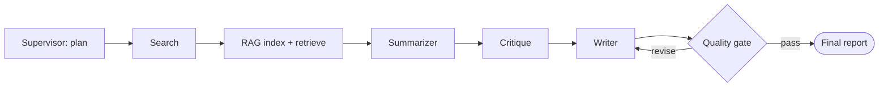

# Scholar — a multi-agent literature review assistant

**Capstone project for Agentic AI, Learners' Space 2026 (Week 4).**

Scholar takes a research topic and produces a synthesized, cited
literature review by coordinating six agents through a LangGraph state
machine: a **Supervisor** that plans the investigation and gate-checks
the final draft, a **Search** agent that queries arXiv, a **RAG**
agent that builds a local vector index over the retrieved papers, a
**Summarizer**, a **Critique** agent that reviews the papers against
each other, and a **Writer** that synthesizes everything into Markdown.

Scholar runs entirely on **free-tier LLM providers** via
[LiteLLM](https://github.com/BerriAI/litellm) — by default Google's
Gemini free tier (AI Studio), with automatic fallback to an OpenRouter
free model and then Groq if needed. No paid API or credit card is
required to run this project.

This is not "one agent with extra steps": no single stage has enough
information to do another stage's job. The Summarizer never sees other
papers' summaries; the Critique agent never sees raw abstracts; the
Writer never touches arXiv or the vector store. Coordination happens
entirely through a shared, typed state object and explicit LangGraph
edges — see [`docs/architecture.md`](docs/architecture.md) for the full
design rationale, including *why* a hybrid Supervisor+Pipeline pattern
was chosen over a "pure" pattern.



## Why this problem

A literature review genuinely needs multiple specialized roles: someone
to find sources, someone to ground and ground-truth them, someone to
summarize each one faithfully, someone to spot how they relate to (or
contradict) each other, and someone to write the synthesis. Doing all of
that in a single prompt tends to produce reviews that just list papers
back to back instead of actually synthesizing — which is exactly the
failure mode the Critique agent and the Supervisor's quality gate exist
to catch.

## Features

- **Provider-agnostic LLM layer** — built on LiteLLM; the default chain
  is Gemini (free) -> OpenRouter (free model) -> Groq, and switching or
  reordering providers is a one-line config change (`config.py`), not a
  code change
- **Real multi-agent orchestration** — Supervisor pattern wrapping an
  internal pipeline, with a bounded Writer ↔ Quality-Gate revision loop
  (see architecture doc for why this hybrid, not a pure pattern)
- **Real RAG** — local sentence-transformer embeddings + FAISS, no
  external embedding API required
- **Real tool use** — live arXiv API search
- **Real failure handling** — exponential backoff + jitter on every
  external call, automatic fallback across LLM providers if one fails,
  graceful degradation (e.g. a paper that fails to summarize falls back
  to its raw abstract instead of vanishing from the review), and
  explicit terminal-failure states rather than crashes
- **Usable three ways**: as a CLI, as a Python library call, or as an
  **MCP server tool** callable from Claude Desktop / Claude Code
- **Fully tested offline** — 29 unit + end-to-end tests with every
  external call faked out, so CI needs no API key (see
  [`.github/workflows/ci.yml`](.github/workflows/ci.yml))

## Repository layout

```
scholar-agent/
├── agents/                 # One file per agent (search, rag, summarizer, critique, writer, supervisor)
├── graph/
│   ├── state.py            # Shared TypedDict state schema
│   └── build_graph.py      # LangGraph StateGraph wiring
├── tools/
│   ├── arxiv_tool.py        # arXiv search, wrapped with retry/backoff
│   └── vector_store.py      # Local embeddings + FAISS RAG store
├── utils/
│   ├── llm.py               # Provider-agnostic LLM wrapper (LiteLLM: Gemini -> OpenRouter -> Groq)
│   ├── retry.py              # Retry-with-backoff decorator
│   ├── prompts.py            # All prompt templates, centralized
│   └── logging_config.py
├── mcp_server/
│   └── server.py            # Exposes the pipeline as an MCP tool
├── tests/                  # Offline unit + end-to-end tests (fakes, no API key needed)
├── examples/
│   └── sample_run.md         # Real captured execution trace + output
├── docs/
│   └── architecture.md       # Full design rationale, diagram, failure-handling details
├── config.py                # Central settings, reads .env
├── main.py                  # `run_review()` — the library entry point
├── cli.py                   # Command-line interface
└── requirements.txt
```

## Setup

Requires Python 3.10+.

```bash
git clone <this-repo-url>
cd scholar-agent
python -m venv .venv && source .venv/bin/activate   # optional but recommended
pip install -r requirements.txt

cp .env.example .env
# edit .env and set GEMINI_API_KEY (the only required secret; get a free
# key at https://aistudio.google.com/apikey)
```

### Quickstart (minimal path)

Once you've done the three steps above, the whole system runs with just:

```bash
pip install -r requirements.txt
cp .env.example .env        # then add GEMINI_API_KEY
python main.py "in-context learning in large language models"
```

`main.py` runs a default topic if you don't pass one, and prints the
final Markdown report straight to stdout. No other configuration is
required — OpenRouter and Groq are optional fallbacks, not prerequisites.

## Usage

### CLI

```bash
python cli.py "in-context learning in large language models"

# with options
python cli.py "diffusion models for audio synthesis" \
    --max-papers 6 \
    --max-revisions 2 \
    --out report.md \
    --json full_state.json \
    -v
```

### As a library

```python
from main import run_review

result = run_review("retrieval augmented generation for long-form QA", max_papers=6)
print(result["final_report"])
print(result["status"])       # "complete" | "failed"
print(result["errors"])       # any non-fatal issues encountered
```

### As an MCP tool (Claude Desktop / Claude Code)

Run the server:

```bash
python -m mcp_server.server
```

Point any MCP client at it over stdio. Example config for Claude Desktop
(`claude_desktop_config.json`):

```json
{
  "mcpServers": {
    "scholar": {
      "command": "python",
      "args": ["-m", "mcp_server.server"],
      "cwd": "/absolute/path/to/scholar-agent",
      "env": { "GEMINI_API_KEY": "your-gemini-api-key-here" }
    }
  }
}
```

Once connected, you can ask Claude something like *"use the scholar tool
to generate a literature review on sparse mixture-of-experts models"* and
it will call `generate_literature_review` directly.

## Running the tests

```bash
pytest                       # all 29 tests, runs in well under a second
pytest --cov=. --cov-report=term-missing   # with coverage
```

No `GEMINI_API_KEY` (or any provider key) or network access is needed to
run the test suite — every external boundary (all three LLM providers,
arXiv, the embedding model/FAISS) is faked in `tests/fakes.py` and the
individual test files.
`tests/test_graph_smoke.py` in particular runs the *entire* compiled
LangGraph app end to end, including the writer/quality-gate revision
loop and both fatal-failure paths, purely against fakes.

## Configuration reference

All tunables are environment variables (see `.env.example`), loaded
centrally in `config.py`:

| Variable | Default | Purpose |
|---|---|---|
| `GEMINI_API_KEY` | — (required for the default setup) | Free Gemini key from [AI Studio](https://aistudio.google.com/apikey); Priority 1 provider |
| `OPENROUTER_API_KEY` | — (optional) | Free OpenRouter key; Priority 2 fallback if Gemini fails |
| `GROQ_API_KEY` | — (optional) | Free Groq key; Priority 3 fallback if both above fail |
| `SCHOLAR_GEMINI_MODEL` | `gemini/gemini-2.5-flash` | Model string passed to LiteLLM for the Gemini provider |
| `SCHOLAR_OPENROUTER_MODEL` | `openrouter/meta-llama/llama-3.1-8b-instruct:free` | Model string for the OpenRouter fallback |
| `SCHOLAR_GROQ_MODEL` | `groq/llama-3.1-8b-instant` | Model string for the Groq fallback |
| `SCHOLAR_MAX_PAPERS` | `8` | Max papers fetched from arXiv per run |
| `SCHOLAR_MAX_WRITER_REVISIONS` | `2` | Bound on the Writer ↔ Quality-Gate loop |
| `SCHOLAR_MAX_RETRIES` | `3` | Retry attempts per external call |
| `SCHOLAR_RETRY_BASE_DELAY` | `1.5` | Base delay (seconds) for exponential backoff |
| `SCHOLAR_EMBEDDING_MODEL` | `all-MiniLM-L6-v2` | Local sentence-transformers model for RAG |
| `SCHOLAR_CHUNK_SIZE` / `SCHOLAR_CHUNK_OVERLAP` | `800` / `120` | RAG chunking (words) |
| `SCHOLAR_TOP_K` | `4` | Chunks retrieved per sub-question |

### Switching providers

Because the LLM layer goes through LiteLLM, changing providers or their
priority is a config-only change — no code edits needed:

- **Use only Groq** (skip Gemini/OpenRouter entirely): just set
  `GROQ_API_KEY` and leave the other two keys blank in `.env` — the
  provider chain in `config.py` automatically only includes providers
  with a non-empty key.
- **Reorder priority**: edit `_build_provider_chain()` in `config.py` —
  it's a plain ordered list.
- **Point at a different free model** on the same provider: override
  `SCHOLAR_GEMINI_MODEL` / `SCHOLAR_OPENROUTER_MODEL` / `SCHOLAR_GROQ_MODEL`
  in `.env`.
- **Add a fourth provider**: LiteLLM supports 100+ providers out of the
  box — add one more `ProviderConfig` entry in `config.py`'s
  `_build_provider_chain()`; `utils/llm.py` needs no changes at all.

## Design rationale, diagram, and failure-handling details

See [`docs/architecture.md`](docs/architecture.md) — it covers, in depth:
why a hybrid Supervisor+Pipeline pattern was chosen over a pure pattern,
the exact division of responsibility between all six agents, the
three-layer failure-handling strategy, the RAG pipeline, and the MCP
integration.

## Judging-criteria self-assessment

| Criterion | Weight | How this project addresses it |
|---|---|---|
| Problem originality & relevance | 25% | A literature-review assistant needs *distinct* reasoning roles (discovery vs. grounding vs. summarizing vs. critique vs. synthesis) that don't collapse into one agent with extra steps |
| Technical execution | 30% | Real LangGraph state machine, real RAG (local embeddings + FAISS), real arXiv tool use, real retry/backoff failure handling, offline test suite with 24 passing tests, MCP server wrapper |
| Orchestration design | 25% | Explicit hybrid Supervisor+Pipeline pattern with a bounded revision loop, documented and justified in `docs/architecture.md`, not just the first pattern that came to mind |
| Clarity & presentation | 20% | This README, `docs/architecture.md`, `examples/sample_run.md`, inline docstrings throughout, and a CI workflow that runs the test suite on every push |

## License

MIT — see [`LICENSE`](LICENSE).
