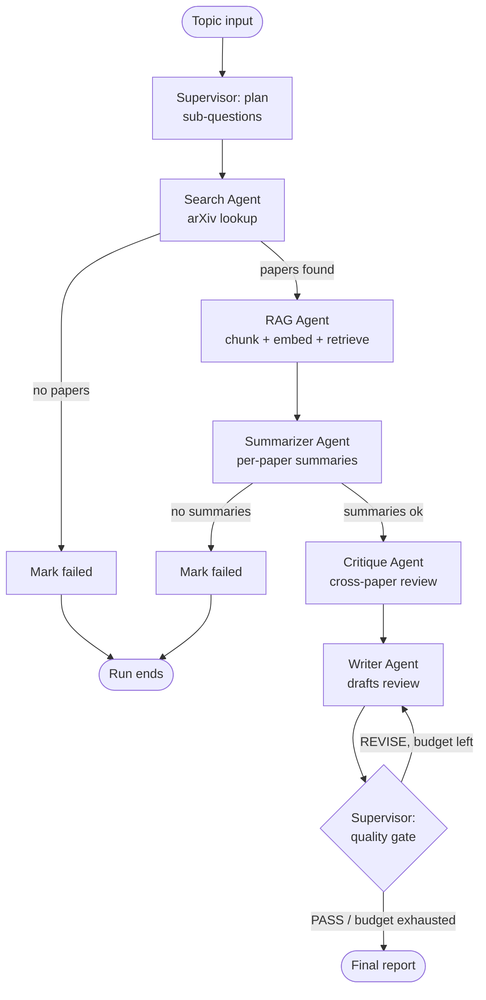

# Architecture

## Orchestration pattern: Supervisor wrapping a Pipeline

Scholar uses a **Supervisor pattern** at the top level, with the middle of
the workflow running as a deterministic **Pipeline** under the Supervisor's
control, plus one bounded **feedback loop** (Writer ↔ Quality Gate).

## Why this hybrid, not a "pure" pattern

The brief lists four canonical patterns: Supervisor, Pipeline,
Parallel+Aggregator, or Hierarchical. Scholar deliberately combines two of
them rather than picking one in isolation, because each pure pattern has a
real weakness for this problem:

- **A pure Pipeline** (search → summarize → critique → write, straight
  through) has no way to recover from a bad final draft. If the Writer
  produces something shallow or fabricates a claim, the pipeline just
  ships it.
- **A pure Supervisor** (an LLM deciding the next step from scratch at
  every turn) is unnecessarily expensive and less predictable for a
  workflow whose middle steps are well understood and always happen in
  the same order. Letting an LLM "decide" to go from search to summarizer
  is peace-of-mind theater, not real flexibility.

So the design puts the Supervisor to work only where judgment genuinely
helps:

1. **Planning** (`supervisor_plan_node`) — breaking an open-ended topic
   into concrete sub-questions is a judgment call, so it's an LLM call.
2. **Quality gating** (`supervisor_quality_gate_node`) — judging whether a
   synthesized report actually synthesizes (rather than just lists
   papers), cites sources, and doesn't fabricate facts is exactly the
   kind of holistic judgment an LLM is good at and a rule can't capture.

Everything else — routing from search → rag_index → summarizer → critique
→ writer — is **deterministic, state-based routing** (see
`agents/supervisor.py`'s `route_after_*` functions). This is faster,
cheaper, and fully unit-testable without hitting an LLM at all (see
`tests/test_supervisor.py`).

This is also why the Critique agent exists as a distinct stage rather than
folding into the Writer: it demonstrates a **Parallel+Aggregator-style**
hand-off nested inside the pipeline — the Critique agent operates on the
*aggregate* of all Summarizer outputs at once, not one paper at a time,
which is a meaningfully different responsibility than either the
Summarizer or the Writer.

## Agent responsibilities (division of labor)

| Agent | Responsibility | Does NOT do |
|---|---|---|
| **Supervisor** (`agents/supervisor.py`) | Plans sub-questions; routes between stages; runs the quality gate and decides on revisions | Never fetches papers, summarizes, or writes prose itself |
| **Search** (`agents/search_agent.py`) | Queries arXiv for papers matching the topic | Doesn't judge paper quality or relevance beyond arXiv's own ranking |
| **RAG / Retrieval** (`agents/rag_agent.py`) | Chunks paper text, builds a FAISS index, retrieves grounding context per sub-question | Doesn't summarize or interpret the retrieved text |
| **Summarizer** (`agents/summarizer_agent.py`) | Produces one factual, grounded summary per paper | Never compares papers to each other or critiques them |
| **Critique** (`agents/critique_agent.py`) | Reviews all summaries together; finds strengths, weaknesses, gaps, and relations between papers | Doesn't touch raw abstracts or rewrite summaries |
| **Writer** (`agents/writer_agent.py`) | Synthesizes summaries + critiques into one Markdown literature review | Doesn't fetch, summarize, or critique — purely a synthesis step |

Each agent reads only the state fields it needs and writes only the
fields it owns (see `graph/state.py`). No agent calls another agent
directly — all coordination happens through the shared `ResearchState`
and the LangGraph edges, which is what makes this a genuine multi-agent
system rather than one long prompt chain.

## State management

`graph/state.py` defines a single `TypedDict`, `ResearchState`, that is
threaded through every node. Key design choices:

- **Additive, not overwritten, bookkeeping fields.** `errors` and `log`
  are appended to, never replaced, so a full run trace survives even
  through partial failures.
- **Explicit status field** (`in_progress` / `complete` / `failed`)
  rather than inferring completion from which fields are populated.
- **Bounded revision counter** (`writer_revisions` vs
  `max_writer_revisions`) is the mechanism that guarantees the
  Writer ↔ Quality Gate loop terminates.

## Failure handling

Four layers, matching Week 4's "failure handling" topic:

1. **Retry with exponential backoff + jitter** (`utils/retry.py`) wraps
   every external call: the arXiv API, and every LLM call made by the
   Planner, Summarizer, Critique, Writer, and Quality Gate. This
   absorbs transient failures (rate limits, timeouts) without operator
   intervention.
2. **Cross-provider fallback** (`utils/llm.py`): every LLM call goes
   through LiteLLM's `completion()` against a prioritized provider chain
   (Gemini -> OpenRouter -> Groq by default). If a provider raises for
   any reason — rate limit, outage, invalid key — `invoke_text()`
   immediately tries the next configured provider before giving up. This
   composes with layer 1: the retry decorator retries the *whole*
   fallback chain on failure, while `invoke_text()`'s job is picking the
   best available provider on any single attempt.
3. **Graceful degradation** at the agent level: if the Summarizer's LLM
   call fails for one paper after retries (and after exhausting the
   provider chain), that paper falls back to a truncated raw abstract
   instead of being dropped from the review entirely
   (`agents/summarizer_agent.py`). If the Critique or Quality Gate calls
   fail entirely, the pipeline proceeds with an empty critique / accepts
   the draft as-is rather than crashing.
4. **Fatal-failure routing**: if Search returns zero papers, or the
   Summarizer produces zero summaries, there is nothing meaningful left
   to build on — the Supervisor's routing functions send the run to an
   explicit `mark_*_failed` node that sets `status="failed"` and ends the
   graph cleanly, rather than propagating exceptions up through
   `main.run_review`.

One implementation subtlety worth documenting: **LangGraph's conditional
edge functions are routing-only** — any mutation a routing function makes
to the state dict is *not* persisted back into the graph's channels
(discovered and fixed during testing; see `tests/test_graph_smoke.py`).
Because of this, terminal-failure bookkeeping (`status = "failed"`) is
done in dedicated nodes (`mark_search_failed_node`,
`mark_summarizer_failed_node`) that are routed *to*, rather than inside
the `route_after_*` functions themselves.

## RAG integration (Week 2 skill folded into Week 4 capstone)

`agents/rag_agent.py` + `tools/vector_store.py` implement a small, fully
local RAG pipeline:

- **Chunking**: simple word-based sliding window (`chunk_text`), tunable
  via `SCHOLAR_CHUNK_SIZE` / `SCHOLAR_CHUNK_OVERLAP`.
- **Embeddings**: `sentence-transformers` (`all-MiniLM-L6-v2` by default)
  — deliberately local/free so it adds no additional API dependency on
  top of the (also free-tier) LLM provider chain.
- **Vector search**: FAISS `IndexFlatIP` over normalized embeddings
  (cosine similarity).
- **Usage**: for each Supervisor-planned sub-question, the top-k most
  relevant chunks across all fetched papers are retrieved and handed to
  the Summarizer as extra grounding context — so summaries reflect not
  just a paper's own abstract but how it relates to the topic's
  sub-questions.

## MCP integration (Week 3 skill exposed as the delivery mechanism)

`mcp_server/server.py` wraps the entire graph behind a single MCP tool,
`generate_literature_review`, using the official `mcp` Python SDK's
`FastMCP`. This means the whole multi-agent system is directly callable
from Claude Desktop, Claude Code, or any other MCP client — the
multi-agent system doesn't just *use* concepts from the bootcamp, it *is*
deployable as one.

## LLM provider layer (provider-agnostic via LiteLLM)

Every agent that needs an LLM (Supervisor's planner and quality gate,
Summarizer, Critique, Writer) calls the exact same function,
`utils.llm.invoke_text()`. That function is the *only* place in the
codebase that knows about specific providers — every agent module just
imports `invoke_text` and passes plain `prompt` / `system` /
`max_tokens` / `temperature` arguments, unaware of what's serving the
request underneath.

`invoke_text()` builds standard OpenAI-compatible chat messages
(`{"role": "system"|"user", "content": ...}`) and hands them to
[LiteLLM](https://github.com/BerriAI/litellm)'s `completion()`, which
supports 100+ providers behind one consistent interface. Scholar's
default provider chain, built in `config.py::_build_provider_chain()`
and tried in this order:

1. **Gemini** (`gemini/gemini-2.5-flash`, via Google AI Studio's free
   tier) — `GEMINI_API_KEY`
2. **OpenRouter** free model (`openrouter/meta-llama/llama-3.1-8b-instruct:free`)
   — `OPENROUTER_API_KEY`
3. **Groq** (`groq/llama-3.1-8b-instant`) — `GROQ_API_KEY`

Only providers with a non-empty API key are included in the chain, so a
setup with just `GEMINI_API_KEY` set runs fine with a one-provider chain
— OpenRouter and Groq are optional fallbacks, not requirements.

If a provider's `completion()` call raises for *any* reason (invalid
key, rate limit, transient outage, unsupported model), `invoke_text()`
logs a warning and immediately tries the next provider in the chain,
rather than failing the whole agent call. Only if every configured
provider fails does `invoke_text()` raise, at which point the calling
agent's own `retry_with_backoff` wrapper (unchanged from the original
design) retries the entire operation — including the full fallback
chain — up to `SCHOLAR_MAX_RETRIES` times.

This design means adding, removing, or reordering providers is a
**one-file, no-agent-code-changes** operation: everything lives in
`config.py`'s provider list and `utils/llm.py`'s fallback loop.

- Swapping the vector store (e.g. to Chroma or pgvector) only requires
  changing `tools/vector_store.py` — the agent-facing interface
  (`add_documents` / `query`) is unchanged.
- Adding a new agent (e.g. a "Trend Agent" that plots publication counts
  over time) means: add a node function in `agents/`, add it to
  `graph/build_graph.py`, and add a routing decision in
  `agents/supervisor.py`. No existing agent needs to change.
- Fine-tuning (Week 2) was intentionally *not* forced in here: none of
  Scholar's tasks (planning, summarizing, critiquing, writing) benefit
  meaningfully from a fine-tuned model over a well-prompted general model,
  and forcing it in would have weakened the project rather than
  strengthened it. This is a deliberate scope decision, not an omission.
